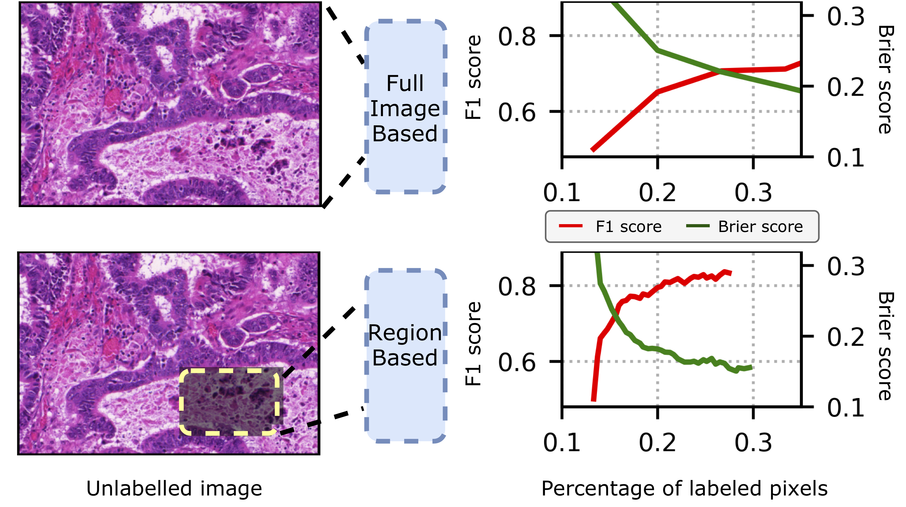

### On uncertainty estimation in active learning for image segmentation 

<br /> This repository provides the implementation for our paper [**On uncertainty estimation in active learning for image segmentation** (Bo Li, Tommy Sonne Alstrøm)](https://arxiv.org/abs/2007.06364). We experimentally show that the region based active learning strategy can lead to higher segmentation accuracy and better calibrated model much faster than full image acquisition:



#### Installation and preparation 

1. Clone and enter this repo:

   ```bash
   git clone https://lab.compute.dtu.dk/papers/on-uncertainty-estimation-in-active-learning.git
   cd on-uncertainty-estimation-in-active-learning
   chmod +x requirement.sh
   chmod +x produce_figure.sh
   ```

2. Create a virtual env with the required packages

   ```bash
   conda env create -f active_learning.yaml
   source activate act
   ```


2. Prepare the Dataset and pertained resnet-50 ckpt 

   ```bash
   ./requirement.sh
   ```


#### Evaluate the model

In order to evaluate the model at each acquisition step, run

``` python
python3 -c 'import Test as te;te.running_test_for_single_acquisition_step(model_dir)'
Args:
  model_dir: the directory that saves the model ckpt
```

#### Train the model

- For full image based active learning, run

  ```python
  python3 -c 'import Train_Active_Full_Im as tafi;tafi.running_loop_active_learning_full_image(stage)'
  Args:
    stage: int, 0:random, 1:VarRatio, 2:Entropy, 3:BALD
  ```

- For region based active learning, run
  
  ```python
  python3 -c 'import Train_Active_Region_Im as tari;tari.running_loop_active_learning_region(stage)'
  Args:
    stage: int, 0:random, 1:VarRatio, 2:Entropy, 3:BALD
  ```

#### Reproduce figures

The statistics that are used for reproducing the figures are saved in folder *Exp_Stat*. In order to reproduce the figures in the paper, run

```bash
./produce_figure.sh
```

#### Citation
If you use this code for your research, please cite our paper:
```
@inproceedings{32948baba85d4c19b9d9594dcf57bf03,
title = "On uncertainty estimation in active learning for image segmentation",
author = "Bo Li and Alstr{\o}m, {Tommy Sonne}",
year = "2020",
language = "English",
booktitle = "Proceedings of 2020 International Conference on Machine Learning: Workshop on Uncertainty and Robustness in Deep Learning",
note = "2020 International Conference on Machine Learning : Workshop on Uncertainty and Robustness in Deep Learning ; Conference date: 12-07-2020 Through 18-07-2020",
}
```

